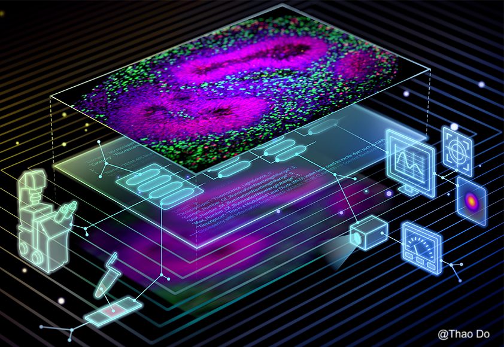
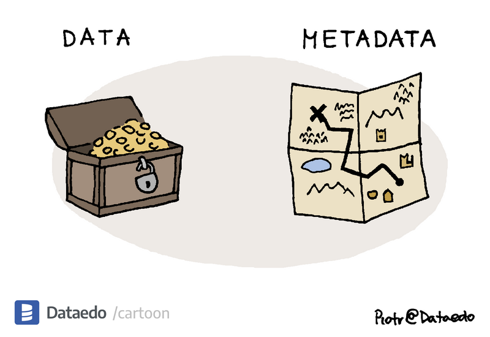

  <h1 style="font-size: 3rem; font-weight: bold;">Imaging-PHD</h1>
  

    <h3 style="margin: 0;">Empowering data reuse and reproducibility through microscopy-community-defined Persistent Hardware Descriptors</h3>
  

  

    
  

  

    <h2>Microscopy Metadata</h2>
    
The introduction of digital light detectors and computers has drastically improved the objectivity of optical observations and changed light microscopy in three profound ways. Deriving valuable and rigorous information from images is completely dependent on the consistent recording and storage of information (also known as metadata) that captures the origin, subsequent processing, and quality of the data. In microscopy experiments, this metadata can be subdivided as follows: (1) experimental and sample metadata; (2) microscopy metadata; and (3) analysis metadata. In turn, microscopy metadata (pink boxes) can be subdivided into two categories: (1) provenance metadata, which includes information that documents microscope hardware specifications, image acquisition settings, and image structur,e and (2) quality-control metadata, which includes metrics that quantitatively assess the performance of the microscope at the time of image acquisition and the quality of image data. 

  

  

    
  

  

    <h2>The Persistent Identification of Instruments supports FAIR principles </h2>
    
Scientific instruments play a pivotal role in research across diverse disciplines, spanning the life sciences, physics, geology, chemistry, and engineering. Accurate identification and description of individual instruments, enabled by globally unique Persistent Identifiers (PIDs) and metadata registries, are crucial for documenting experimental methods and linking instruments with samples, resulting data (i.e., data provenance), the scientific literature, RDMS platform, and the institutions, core facilities and individuals involved in research. Tracking each unique device, rather than solely recording its model (i.e., class), avoids tedious data entry, streamlines institutional inventories for strategic planning, reporting, and funding purposes, promotes access to scientific information and advanced technologies, enhances the sustainability of core facilities through the recognition of their essential role in scientific advancement, and optimizes resource utilization1. As such, instrument PIDs are essential for reproducibility, data trust and sharing, credit attribution to core facilities, the equitable and efficient use of research resources and ensuring adherence to FAIR data principles.

  

  

    
  

  

    <h2>Imaging-PHD provides PIDs for Instruments and Hardware Descriptors</h2>
    
The Imaging-PHD project was recently funded thanks to a grant awarded to Drs. Strambio-De-Castillia (PI), Lacoste and Mr. Rigano. The Imaging-PHD cyberinfrastructure will 1) leverage the existing Micro‑Meta App GUI to enable users to author hardware descriptors. 2) Build back-end services to manage pre‑publication PHDs, support their citable release and facilitate searchable exploration of published PHDs. To achieve this goal, the back‑end assigns DOIs to individual published PHDs, assigns a Persistent Identifier (PID) to instrument models (i.e., RRIDs) and instances (i.e., PIDINST), links instruments to RRID‑identified core facilities, and discovers & aggregates published PHDs metadata to locate microscopes with particular features, and compare instruments across labs and facilities. By providing a standardized framework for capturing this essential information, the project enhances the reliability of scientific results, makes advanced technologies more accessible, facilitates credit attribution to instrument custodians at core facilities, and supports long-term data preservation, ultimately advancing scientific research practices.

  

