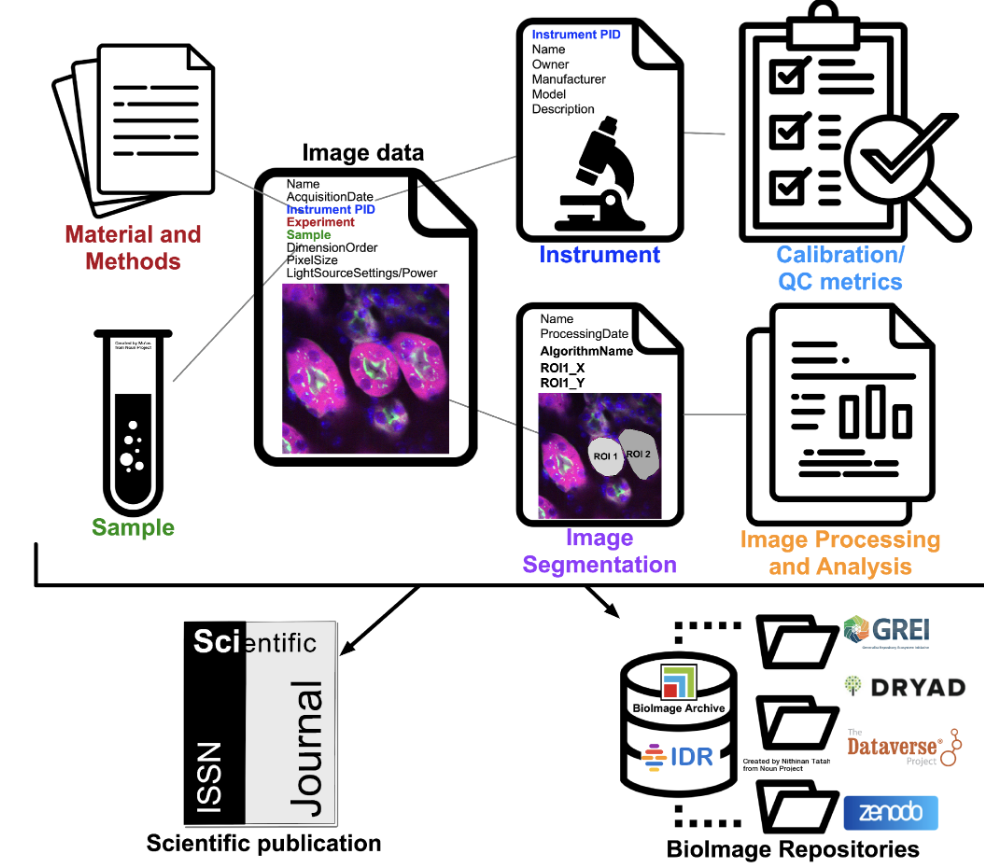
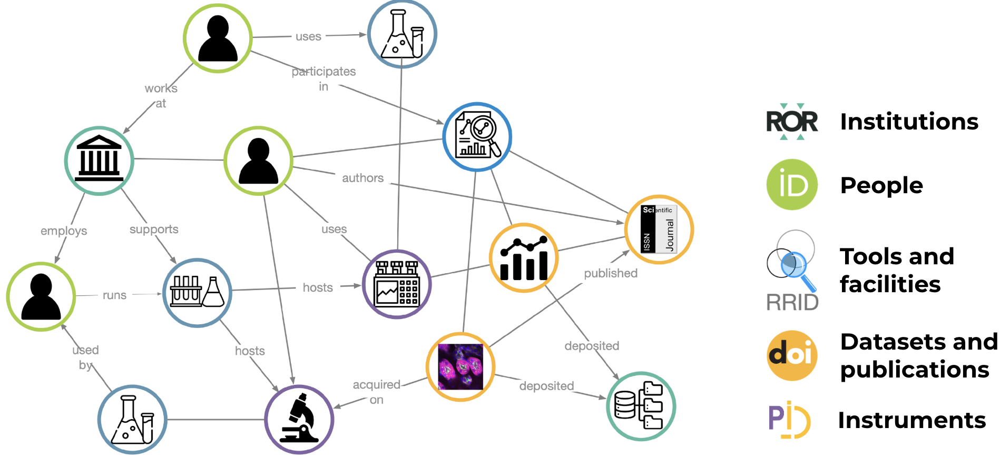
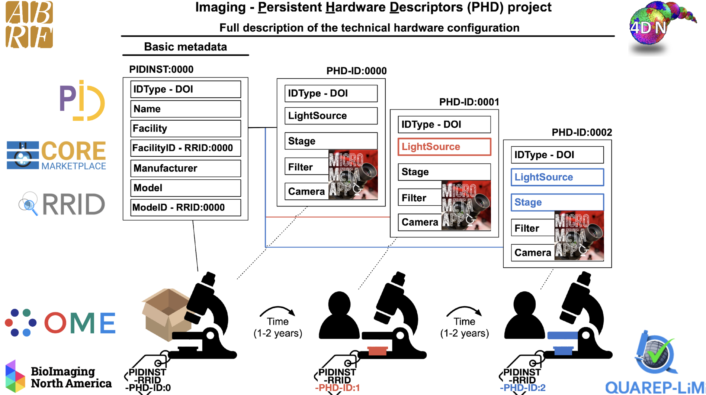

  <h1 style="font-size: 3rem; font-weight: bold;">Imaging-PHD</h1>
  

    <h3 style="margin: 0;">Empowering data reuse and reproducibility through microscopy-community-defined Persistent Hardware Descriptors</h3>
  

  

    
  

  

    <h2>Persistent Identifiers Help Keep Track of Microscopy Metadata</h2>
    
Microscopy metadata is often scattered across lab notebooks, instrument hardware specifications, image files, and quality-control and image analysis logs. Connecting these fragments is essential: Persistent Identifiers (PIDs) link the data, to the research resources used to produce it, to the researchers and ultimately to publications that resulted from the work. 
      A typical imaging experiment can be subdivided into experimentation and sample preparation, image acquisition, and post-acquisition bioimage processing and analysis. Each phase produces essential image metadata, which can accordingly be subdivided into: (1) experimental and sample metadata; (2) microscopy metadata (describing hardware specifications, image acquisition settings and QC); and (3) analysis metadata. 
      This project tackles a key piece of that puzzle: connecting image data to the scientific instrument that produced it through an Instrument Persistent Identifier <a href="https://www.pidinst.org/">
(PIDINST)</a>, which in turn links to a standardized, machine-readable description of the instrument's hardware configuration, which is called a Persistent Hardware Descriptor (PHD).

  

  

    
  

  

    <h2>The Persistent Identification of Instruments Supports FAIR Principles </h2>
    
Scientific instruments generate the data that drives discovery — but only if we can reliably track which instrument produced what data, and where and by whom it was used. Persistent Identifiers (PIDs) give each instrument a unique, permanent label, making it possible to link instruments to samples, datasets, publications, and the facilities that support research. This improves reproducibility, enables proper credit to core facilities, and supports the FAIR data principles — making science more transparent, trustworthy, and accessible.

  

  

    
  

  

    <h2>Imaging-PHD provides PIDs for Instruments and Hardware Descriptors</h2>
    
Imaging-PHD builds on the existing Micro-Meta App to provide a streamlined tool for documenting individual instruments. Each published instrument record receives a unique, permanent identifier — linking specific microscopes to their home facilities, the data they generate, and the researchers who use them.
    A searchable registry allows scientists to discover instruments with particular features and compare equipment across labs and institutions.
    By standardizing how instruments are described and identified, Imaging-PHD improves the reliability of scientific results, gives proper credit to core facility staff, and makes advanced imaging technologies more accessible to the broader research community.

  

